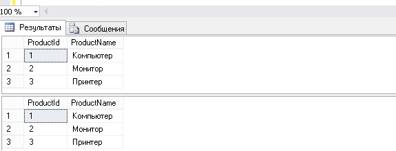

___
# Вопрос 11: Удаление данных. Использование выражения TRUNCATE TABLE. Удаление строк на основе данных к другой таблице.
___

Варианты (операторы) удаления в SQL:

1. DROP - полное удаление таблицы из структуры данных (вместе с данными). То есть очищаются не только данные, но и метаданные. Работает мгновенно.
2. TRUNCATE - полная очистка таблицы с сохранением структуры таблицы (очищаются только строки таблицы, колонки остаются прежними). Работает мгновенно.
3. DELETE - удаление записей в таблице по определенному условию. Занимает определенное время.

Инструкции DELETE и DROP TABLE существенно отличаются друг от друга. Инструкция DELETE удаляет (частично или полностью) содержимое таблицы, тогда как инструкция DROP TABLE удаляет как содержимое, так и схему таблицы. Таким образом, после удаления всех строк посредством инструкции DELETE таблица продолжает существовать в базе данных, а после выполнения инструкции DROP TABLE таблица больше не существует.

### Инструкция DELETE

**DELETE** – это SQL инструкция языка T-SQL, которая удаляет одну или несколько строк из таблицы или представления в Microsoft SQL Server, при этом эта операция всегда полностью регистрируется в журнале транзакций, т.е. каждая удаленная строка. Имеет две различные формы:

```SQL
DELETE FROM table_name
    [WHERE predicate];
    
DELETE table_name
    FROM table_name [,...n]
    [WHERE condition]; 
```

Удаляются все строки, которые удовлетворяют условию в предложении WHERE. Т.к. эта инструкция оперирует строками, а не столбцами, то явно перечислять столбцы в ней не рекомендуется. Использование первой формы инструкции DELETE показано в примере ниже, в котором происходит удаление из таблицы Works_on всех сотрудников с должностью 'Менеджер':

```SQL
USE SampleDb;

DELETE FROM Works_on
    WHERE Job = 'Менеджер';
```

Предложение WHERE инструкции DELETE может содержать вложенный запрос, как это показано в примере ниже:

```SQL
USE SampleDb;

DELETE FROM Works_on
    WHERE EmpId IN
        (SELECT Id
         FROM Employee
         WHERE LastName = 'Вершинина');

DELETE FROM Employee
    WHERE LastName = 'Вершинина';
```

Поскольку сотрудница *Вершинина* уволилась, из базы данных удаляются все записи, связанные с ней. Запрос из этого примера можно также выполнить с помощью предложения FROM, как это показано ниже. Тогда семантика этого предложения такая же, как и предложения FROM в инструкции UPDATE.

```SQL
USE SampleDb;

DELETE Works_on
    FROM Works_on w, Employee e
    WHERE w.EmpId = e.Id
        AND LastName = 'Вершинина';

DELETE FROM Employee
    WHERE LastName = 'Вершинина';
```

Использование предложения WHERE в инструкции DELETE не является обязательным. Если это предложение отсутствует, то из таблицы удаляются все строки:

```SQL
USE SampleDb;

-- Удаление всех строк таблицы
DELETE FROM Works_on;
```

### Инструкция TRUNCATE TABLE

**TRUNCATE TABLE** – это SQL инструкция в языке Transact-SQL, которая удаляет все строки в таблице, не записывая в журнал транзакций удаление отдельных строк данных. TRUNCATE TABLE похожа на инструкцию DELETE без предложения WHERE, но она выполняется быстрее и требует 
меньше ресурсов.

Самым очевидным здесь является то, что если Вам нужно удалить не все данные из таблицы, а только часть, т.е. по условию WHERE, то Вы можете использовать только DELETE.

А, например, если Вам приходится периодически очищать всю таблицу, и значения идентификаторов не важны, то вполне возможно предпочтительней будет использовать TRUNCATE TABLE, так как это будет быстрей, и ресурсов затрачиваться будет меньше.

Инструкция TRUNCATE TABLE имеет следующий синтаксис:

```SQL
TRUNCATE TABLE table_name
```

### Преимущества TRUNCATE TABLE и отличия от DELETE

* TRUNCATE TABLE требуется меньший объем журнала транзакций, так как она в отличие от инструкции DELETE не заносит в журнал транзакций запись для каждой удаляемой строки, DELETE производит удаление по одной строке отражая все действия в журнале транзакций;
* TRUNCATE TABLE выполняется быстрее по сравнению с инструкцией DELETE также за счёт меньшего использования журнала транзакций;
* Используется меньшее количество блокировок. Инструкция TRUNCATE TABLE в отличие от инструкции DELETE блокирует таблицу и страницу, а не каждую строку таблицы;
* Если инструкция TRUNCATE TABLE применяется к таблице, которая содержит столбец идентификаторов, счетчик этого столбца сбрасывается до начального значения. Инструкция DELETE не сбрасывает счетчик столбца идентификаторов;
* Инструкция TRUNCATE TABLE не активирует триггер, поскольку она не записывает в журнал удаление отдельных строк.

**Примечание!** Преимущества TRUNCATE TABLE в некоторых случаях, могут быть и недостатками.

Инструкция TRUNCATE TABLE удаляет все строки (данные) таблицы, но структура таблицы: столбцы, ограничения, индексы и так далее сохраняются. Для того чтобы полностью удалить таблицу и ее определение, следует использовать инструкцию DROP TABLE.

**Ограничения TRUNCATE TABLE**
* Если на таблицу ссылается ограничение FOREIGN KEY, то TRUNCATE TABLE использовать нельзя;
* Если таблица является частью индексированного представления, то TRUNCATE TABLE также нельзя использовать;
* Если таблица опубликована с использованием репликации транзакций или репликации слиянием, то инструкцию TRUNCATE TABLE использовать нельзя.

**Пример использования инструкции TRUNCATE TABLE**
В примере создаётся таблица со столбцом идентификаторов, затем добавляются данные и удаляются инструкцией TRUNCATE TABLE, затем снова добавляются данные и происходит проверка, сбросился ли счетчик столбца идентификаторов на начальное значение.

```SQL
--Создаем тестовую таблицу
    CREATE TABLE TestTable(
        ProductId INT IDENTITY(1,1) NOT NULL,
        ProductName VARCHAR(100) NOT NULL
    )
    --Добавляем данные
    INSERT INTO TestTable
        VALUES ('Компьютер'),
               ('Монитор'),
               ('Принтер')
    --Выборка данных                   
    SELECT * FROM TestTable    
    --Удаляем все данные инструкцией TRUNCATE TABLE
    TRUNCATE TABLE TestTable
    --Снова добавляем данные
    INSERT INTO TestTable
        VALUES ('Компьютер'),
               ('Монитор'),
               ('Принтер')
    --Выборка данных
    SELECT * FROM TestTable
```

Как видно на рисунке, счетчик сброшен, инструкция TRUNCATE TABLE отработала.



### Удаление строк на основе данных к другой таблице

В следующих примерах показано два способа удаления строк в одной таблице на основании данных в другой таблице. В обоих примерах из таблицы *SalesPersonQuotaHistory* в базе данных AdventureWorks2012 будут удалены строки на основании сведений о продажах за текущий год, хранящихся в таблице *SalesPerson*. В первой инструкции DELETE показано основанное на вложенных запросах и совместимое с ISO решение, а во второй инструкции DELETE используется оператор FROM языка Transact-SQL для объединения двух таблиц.

```SQL
-- Стандартный подзапрос SQL-2003  
  
DELETE FROM Sales.SalesPersonQuotaHistory   
WHERE BusinessEntityID IN   
    (SELECT BusinessEntityID   
     FROM Sales.SalesPerson   
     WHERE SalesYTD > 2500000.00);  
GO
```

```SQL
-- Нет необходимости упоминать целевую таблицу более одного раза. 
  
DELETE spqh  
  FROM  
        Sales.SalesPersonQuotaHistory AS spqh  
    INNER JOIN Sales.SalesPerson AS sp  
        ON spqh.BusinessEntityID = sp.BusinessEntityID  
  WHERE  sp.SalesYTD > 2500000.00; 
```
