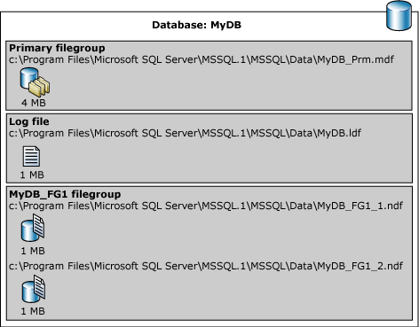

___
# Вопрос 17: Организация хранения базы данных на уровне файлов. Работа журнала транзакций.
___

## Файлы и файловые группы

Базовый принцип, который лежит в основе работы SQL Server с хранилищами данных, заключается в том, что базы данных состоят из файлов трёх типов.

* Первичные файлы данных. В этих файлах хранится информация базы данных. Файлы данных SQL Server представляют собой файлы NTFS с расширением .mdf. Простейшая база данных обычно состоит из одного файла данных, но может состоять и из многих файлов данных, находя­щихся на одном или нескольких дисках.
* Вторичные файлы данных. Ко вторичным файлам данных относятся все файлы данных, за исключением первичного файла данных. Базы данных могут вообще не содержать вторичных файлов данных, или содержать один или несколько вторичных файлов данных. Для имени вторичного файла данных рекомендуется использовать расширение NDF.
* Файлы журналов. В этих файлах хранятся транзакции базы данных, что позволяет восстановить базу данных на определенный момент времени. Файлы журналов транзакций SQL Server представляют собой файлы   NTFS  с  расширением .ldf. В базе данных может быть много файлов журна­лов, расположенных на одном или нескольких дисках.

Если для создания базы дан­ных используется среда SQL Server Management Studio (SSMS), то файлы данных и журналов хра­нятся на том же диске по умол­чанию. Если не указано иное, то файлы данных и журналов создаются в том же каталоге, что и системные базы данных SQL Server.

Файлы SQL Server имеют два типа имен файлов.

* logical_file_name: имя, используемое для ссылки на физический файл во всех инструкциях Transact-SQL. Логическое имя файла должно соответствовать правилам для идентификаторов SQL Server и быть уникальным среди логических имен файлов в соответствующей базе данных. Оно задается с помощью аргумента NAME в ALTER DATABASE. Дополнительные сведения см. в разделе Параметры инструкции ALTER DATABASE (Transact-SQL) для файлов и файловых групп.
* os_file_name: имя физического файла, включающее путь к каталогу. Оно должно соответствовать правилам для имен файлов операционной системы. Оно задается с помощью аргумента FILENAME в ALTER DATABASE. Дополнительные сведения см. в разделе Параметры инструкции ALTER DATABASE (Transact-SQL) для файлов и файловых групп.

___

Все файлы данных хранятся в файловых группах, перечисленных в следующей таблице.

Файловая группа | Описание
--- | ---
Первичная | Файловая группа, содержащая первичный файл. Все системные таблицы размещены в первичной файловой группе
Данные, оптимизированные для памяти | В основе оптимизированной для памяти файловой группы лежит файловая группа файлового потока
Файловый поток |
Пользовательские процедуры | Любая файловая группа, созданная пользователем при создании или изменении базы данных

Если в базе данных создаются объекты без указания файловой группы, к которой они относятся, они назначаются файловой группе по умолчанию. В любом случае только одна файловая группа создается как файловая группа по умолчанию.
Файловая группа PRIMARY является группой по умолчанию, если только она не была изменена инструкцией ALTER DATABASE. Системные объекты и таблицы распределяются внутри первичной файловой группы, а не новой файловой группой по умолчанию.

В следующем примере создается база данных на основе экземпляра SQL Server. База данных содержит первичный файл данных, пользовательскую файловую группу и файл журнала. Первичный файл данных входит в состав первичной файловой группы, а пользовательская файловая группа состоит из двух вторичных файлов данных. Инструкция ALTER DATABASE придает пользовательской файловой группе статус файловой группы по умолчанию. Затем создается таблица, определяющая пользовательскую файловую группу.

```sql
USE master;
GO
-- Create the database with the default data
-- filegroup, filstream filegroup and a log file. Specify the
-- growth increment and the max size for the
-- primary data file.
CREATE DATABASE MyDB
ON PRIMARY
  ( NAME='MyDB_Primary',
    FILENAME=
       'C:\Program Files\Microsoft SQL Server\MSSQL.1\MSSQL\data\MyDB_Prm.mdf',
    SIZE=4MB,
    MAXSIZE=10MB,
    FILEGROWTH=1MB),
FILEGROUP MyDB_FG1
  ( NAME = 'MyDB_FG1_Dat1',
    FILENAME =
       'C:\Program Files\Microsoft SQL Server\MSSQL.1\MSSQL\data\MyDB_FG1_1.ndf',
    SIZE = 1MB,
    MAXSIZE=10MB,
    FILEGROWTH=1MB),
  ( NAME = 'MyDB_FG1_Dat2',
    FILENAME =
       'C:\Program Files\Microsoft SQL Server\MSSQL.1\MSSQL\data\MyDB_FG1_2.ndf',
    SIZE = 1MB,
    MAXSIZE=10MB,
    FILEGROWTH=1MB),
FILEGROUP FileStreamGroup1 CONTAINS FILESTREAM
  ( NAME = 'MyDB_FG_FS',
    FILENAME = 'C:\Data\filestream1')
LOG ON
  ( NAME='MyDB_log',
    FILENAME =
       'C:\Program Files\Microsoft SQL Server\MSSQL.1\MSSQL\data\MyDB.ldf',
    SIZE=1MB,
    MAXSIZE=10MB,
    FILEGROWTH=1MB);
GO
ALTER DATABASE MyDB 
  MODIFY FILEGROUP MyDB_FG1 DEFAULT;
GO

-- Create a table in the user-defined filegroup.
USE MyDB;
CREATE TABLE MyTable
  ( cola int PRIMARY KEY,
    colb char(8) )
ON MyDB_FG1;
GO

-- Create a table in the filestream filegroup
CREATE TABLE MyFSTable
(
    cola int PRIMARY KEY,
  colb VARBINARY(MAX) FILESTREAM NULL
)
GO
```

Данная иллюстрация обобщает все вышесказанное (кроме данных файлового потока).



## Страницы

[_См. пункт "Страницы и экстенты" в билете 18._](18.md)

## Журнал транзаций

Опция LOG ON в команде CREATE DATABASE используется для определения журнала транзакций создаваемой базы данных. Впервые созданные данные помещаются в файл данных, а запись изменений этих данных помещается в файле журнала транзакций.

Поскольку большинство изменений вносимых в базу, журналируются, необходимо отслеживать размер журнала транзакций, потому что, если данные постоянно меняются журнал соответственно вырастает.
Каждая контрольная точка Microsoft SQL Server гарантирует что все записи в журнале и все модифицированные страницы данных корректно записаны на диск. Файл журнала транзакций используется Microsoft SQL Server в процессе операции восстановления базы данных, чтобы зафиксировать завершенные транзакции и откатить незавершенные. Информация, записывающаяся в журнал транзакций, включает:

* Время начала каждой транзакции;
* Изменения внутри каждой транзакции и информацию для их отката (для этого используются снимки страниц данных до, и после транзакции);
* Информация о распределении памяти для страниц БД (выделении и изъятии экстента);
* Информация о завершении или откате каждой транзакции.

Эти данные Microsoft SQL Server использует в целях повышения целостности данных. Журнал транзакций используется при старте SQL Server, для того чтобы отменить сделанные изменения и установить состояние базы данных на момент, предшествующий началу изменений.

### Некоторые операции не всегда журналируются

* Microsoft SQL Server не выполняет журналирование в тех случаях, когда могут возникнуть проблему с нехваткой дискового пространства при быстром увеличении журнала транзакций.

* Для некоторых операций, таких как CREATE INDEX, Microsoft SQL Server не ведет протоколирование для каждой новой страницы. Вместо этого SQL Server записывает достаточно информации, чтобы определить, как CREATE INDEX отработал, и принять решение о том фиксировать изменения или сделать откат.

### Резервное копирование журнала транзакций

Для того чтобы повысить эффективность стратегии резервирования и восстановления БД, необходимо периодически делать резервные копии журнала транзакций. Создать резервную копию журнала транзакций можно с помощью команды BACKUP LOG. При использовании копирования журнала транзакций, при необходимости, базу данных можно восстановить на любой момент времени, содержащийся в копии журнала.

Если журнал транзакций урезается с помощью оператора BACKUP LOG , то нельзя делать его копию до тех пор, пока не будет создана полная копия базы данных или дифференциальная копия. Дифференциальная копия содержит в себе только те изменения, которые произошли с момента последней полной копии базы данных.