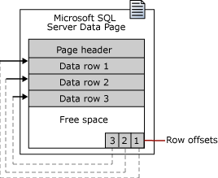

# Вопрос 18: Создание и модификация БД. Просмотр свойств БД. Создание файловых групп. «Сжатие» (Shrinking) файлов БД. Организация хранения данных. Страницы и экстенты. Способы повышения производительности сервера.

## Организация хранения данных.
### Файлы базы данных
SQL Server имеют три типа файлов.

**Первичная** - Первичный файл данных содержит сведения, необходимые для запуска базы данных, и ссылки на другие файлы в базе данных. Данные и объекты пользователя могут храниться в данном файле или во вторичном файле данных. В каждой базе данных имеется один первичный файл данных. Для имени первичного файла данных рекомендуется расширение MDF.

**Вторичная** - Вторичные файлы данных не являются обязательными; это пользовательские файлы, в которых хранятся данные пользователя. Вторичные файлы могут быть использованы для распределения данных на несколько дисков, в этом случае каждый файл записывается на отдельный диск. Кроме того, если размер базы данных превышает максимальный размер для одного файла Windows, можно использовать вторичные файлы данных, таким образом база данных сможет расти дальше. Для имени вторичного файла данных рекомендуется расширение NDF.

**Журнал транзакций** - Файлы журнала транзакций содержат сведения, используемые для восстановления базы данных. Для каждой базы данных должен существовать хотя бы один файл журнала. Для файлов журнала транзакций рекомендуется расширение LDF.

### Файловые группы

У каждой базы данных есть первичная файловая группа. Эта файловая группа содержит первичный файл данных и все вторичные файлы, не входящие в другие файловые группы. Пользовательские файловые группы могут создаваться для удобства администрирования, распределения и размещения данных.

Например, три файла — _Data1.ndf_, _Data2.ndf_ и _Data3.ndf_ — могут быть созданы на трех дисках соответственно и отнесены к файловой группе _fgroup1_. В этом случае можно создать таблицу на основе файловой группы _fgroup1_. Запросы данных из таблицы будут распределены по трем дискам, и это улучшит производительность. Подобного улучшения производительности можно достичь и с помощью одного файла, созданного на чередующемся наборе дискового массива RAID. Тем не менее файлы и файловые группы позволяют без труда добавлять новые файлы на новые диски.

Все файлы данных хранятся в файловых группах, перечисленных в следующей таблице:

Файловая группа | Описание
--- | --- 
Первичная | Файловая группа, содержащая первичный файл. Все системные таблицы размещены в первичной файловой группе.
Данные, оптимизированные для памяти | В основе оптимизированной для памяти файловой группы лежит файловая группа файлового потока.
Файловый поток | Пользовательские процедуры	Любая файловая группа, созданная пользователем при создании или изменении базы данных.

### Страницы и экстенты
Основной единицей хранилища данных в SQL Server является **страница**. Место на диске, предоставляемое для размещения файла данных (файл MDF или NDF) в базе данных, логически разделяется на страницы с непрерывным перечислением от 0 до n. Дисковые операции ввода-вывода выполняются на уровне страницы. Это означает, что SQL Server считывает или записывает целые страницы данных.

**Примечание!** Файлы журнала не содержат страниц, в них содержится последовательность записей журнала.

Тип страницы | Содержание
--- | ---
Data | Строки со всеми данными, за исключением типов text, ntext, image, nvarchar(max), varchar(max), varbinary(max) и xml, если для текста в строке установлено значение ON.
Индекс | Содержимое индекса.
Текст/изображение | Типы данных больших объектов: text, ntext, image, nvarchar(max), varchar(max), varbinary(max) и данные xml. Столбцы переменной длины, когда размер строки данных превышает 8 КБ: varchar, nvarchar, varbinary и sql_variant.
Глобальная карта распределения, общая глобальная карта распределения | Сведения о том, размещены ли экстенты.
Свободное место на страницах (PFS) | Сведения о размещении страниц и доступном на них свободном месте.
Карта распределения индекса | Сведения об экстентах, используемых таблицей или индексом для единицы распределения.
Схема массовых изменений | Сведения об экстентах, измененных массовыми операциями со времени последнего выполнения инструкции BACKUP LOG для единицы распределения.
Карта изменений для разностной резервной копии | Сведения об экстентах, измененных с момента последнего выполнения инструкции BACKUP DATABASE для единицы распределения.



Строки данных заносятся на страницу последовательно, сразу же после заголовка. Таблица смещения строк начинается в конце страницы; каждая таблица смещения строк содержит одну запись для каждой строки на странице. Каждая запись регистрирует, насколько далеко от начала страницы находится первый байт строки. Записи в таблице смещения строк находятся в обратном порядке относительно последовательности строк на странице.

**Экстент** — это коллекция, состоящая из восьми физически непрерывных страниц; они используются для эффективного управления страницами. Все страницы организуются в экстенты.

В SQL Server есть два типа экстентов:
* Однородные экстенты принадлежат одному объекту, и все восемь страниц экстента может использовать только этот владеющий объект.
* Смешанные экстенты могут находиться в общем пользовании максимум у восьми объектов. Каждая из восьми страниц в экстенте может находиться во владении разных объектов.


---

## Создание БД
### Команда CREATE DATABASE
```sql
CREATE DATABASE database_name
[ CONTAINMENT = { NONE | PARTIAL } ]
[ ON
      [ PRIMARY ] <filespec> [ ,...n ]
      [ , <filegroup> [ ,...n ] ]
      [ LOG ON <filespec> [ ,...n ] ]
]
[ COLLATE collation_name ]
[ WITH <option> [,...n ] ]
[;]

<option> ::=
{
      FILESTREAM ( <filestream_option> [,...n ] )
    | DEFAULT_FULLTEXT_LANGUAGE = { lcid | language_name | language_alias }
    | DEFAULT_LANGUAGE = { lcid | language_name | language_alias }
    | NESTED_TRIGGERS = { OFF | ON }
    | TRANSFORM_NOISE_WORDS = { OFF | ON}
    | TWO_DIGIT_YEAR_CUTOFF = <two_digit_year_cutoff>
    | DB_CHAINING { OFF | ON }
    | TRUSTWORTHY { OFF | ON }
    | PERSISTENT_LOG_BUFFER=ON ( DIRECTORY_NAME='<Filepath to folder on DAX formatted volume>' )
}

<filestream_option> ::=
{
      NON_TRANSACTED_ACCESS = { OFF | READ_ONLY | FULL }
    | DIRECTORY_NAME = 'directory_name'
}

<filespec> ::=
{
(
    NAME = logical_file_name ,
    FILENAME = { 'os_file_name' | 'filestream_path' }
    [ , SIZE = size [ KB | MB | GB | TB ] ]
    [ , MAXSIZE = { max_size [ KB | MB | GB | TB ] | UNLIMITED } ]
    [ , FILEGROWTH = growth_increment [ KB | MB | GB | TB | % ] ]
)
}

<filegroup> ::=
{
FILEGROUP filegroup name [ [ CONTAINS FILESTREAM ] [ DEFAULT ] | CONTAINS MEMORY_OPTIMIZED_DATA ]
    <filespec> [ ,...n ]
}
```

### Описание параметров

#### database_name
**database_name** — имя новой базы данных. Имена баз данных должны быть уникальны внутри экземпляра SQL Server и должны соответствовать правилам для идентификаторов.

#### CONTAINMENT

**CONTAINMENT** - указывает состояние включения базы данных.

> **NONE** = неавтономная база данных.

> **PARTIAL** = частично автономная база данных.

#### ON

**ON** - Указывает, что дисковые файлы, используемые для хранения разделов данных в базе данных, файлов данных, определяются явно. Параметр **ON** необходимо применять, если за ним следует список элементов **<filespec>** с разделителями-запятыми, которые определяют файлы данных первичной файловой группы. За списком файлов в первичной файловой группе может следовать необязательный список элементов **<filegroup>** с разделителями-запятыми, которые определяют файловые группы пользователей и принадлежащие им файлы.

**PRIMARY** - указывает, что связанный список **<filespec>** определяет первичный файл. Первый файл, указанный в элементе **<filespec>** в первичной файловой группе, становится первичным файлом. В базе данных может быть только один первичный файл. Если параметр **PRIMARY** не указан, то первый файл списка в инструкции CREATE DATABASE становится первичным файлом.

**LOG ON** - указывает, что дисковые файлы, используемые для хранения журнала базы данных, то есть файлы журналов, определяются явно. За параметром **LOG ON** следует список элементов **<filespec>** с разделителями-запятыми, которые определяют файлы журналов. Если параметр **LOG ON** не указан, автоматически создается один файл журнала, размер которого определяется большей из следующих двух величин: 512 КБ или 25 процентов от суммы размеров всех файлов данных в базе данных. Этот файл помещается в местоположение для журнала по умолчанию. Параметр **LOG ON** не может указываться для моментального снимка базы данных.

#### COLLATE

**COLLATE** collation_name - задает параметры сортировки по умолчанию для базы данных. Именем параметров сортировки может быть либо имя параметров сортировки Windows, либо имя параметров сортировки SQL. Если параметр не указан, базе данных назначаются параметры сортировки по умолчанию для экземпляра SQL Server. Имя параметров сортировки не может указываться для моментального снимка базы данных.

#### WITH options

**NON_TRANSACTED_ACCESS** = { OFF | READ_ONLY | FULL } - указывает уровень нетранзакционного доступа FILESTREAM к базе данных.

> **OFF** - Нетранзакционный доступ отключен.

> **READONLY** - Данные FILESTREAM в этой базе данных могут быть считаны нетранзакционными процессами.

> **FULL** - Полный нетранзакционный доступ к FILESTREAM FileTable включен.

**DIRECTORY_NAME = <directory_name>** - Имя каталога, совместимое с Windows. Это имя должно быть уникально среди всех имен Database_Directory в экземпляре SQL Server. Проверка уникальности выполняется с учетом регистра, независимо от параметров сортировки SQL Server. Этот параметр необходимо назначить до создания FileTable в этой базе данных.

Следующие параметры разрешаются, только если параметр **CONTAINMENT** установлен в состояние **PARTIAL**. Если параметр **CONTAINMENT** установлен в состояние **NONE**, возникнут ошибки.

**DEFAULT_FULLTEXT_LANGUAGE** - настройка параметра конфигурации полнотекстового поиска поумолчанию.

**DEFAULT_LANGUAGE** - настройка параметра сервера языка поумолчанию.

**NESTED_TRIGGERS** - настройка параметра сервера nested triggers. Под этим подразумевается выполнение действия, вызывающего срабатывание другого триггера, который может инициировать другой триггер, и т. д. Когда параметр nested triggers принимает значение 0, триггеры AFTER не могут вызывать каскадные действия. Если параметр nested triggers равен 1 (значение по умолчанию), триггеры AFTER могут выполнять каскадные действия глубиной до 32 уровней. Триггеры INSTEAD OF могут быть вложенными вне зависимости от этого параметра.

**TRANSFORM_NOISE_WORDS** - настройка параметра сервера С помощью параметра конфигурации сервера transform noise words отключите сообщения об ошибках, если из-за пропускаемых слов (т. е. стоп-слов) логическая операция в полнотекстовом запросе возвращает 0 строк. Этот параметр удобно использовать в полнотекстовых запросах с предикатом CONTAINS, в котором логические операции или операции NEAR содержат пропускаемые слова. Возможные значения описаны в следующей таблице.

**TWO_DIGIT_YEAR_CUTOFF** - четыре цифры, обозначающие год. Значение по умолчанию — 2049.

**DB_CHAINING**
Если указано значение ON, то база данных может быть источником или целевой базой данных в межбазовой цепочке владения.
Если задано значение OFF, то база данных не может участвовать в межбазовых цепочках владения. Значение по умолчанию — OFF.

**TRUSTWORTHY**
Если задано значение ON, то модули базы данных (например, представления, определяемые пользователем функции и хранимые процедуры), в которых используется контекст олицетворения, могут обращаться к ресурсам, расположенным за пределами базы данных.
Если задано значение OFF, то модули базы данных в контексте олицетворения не могут обращаться к ресурсам, расположенным за пределами базы данных. Значение по умолчанию — OFF.
Параметр **TRUSTWORTHY** устанавливается в значение OFF при каждом присоединении базы данных.

**PERSISTENT_LOG_BUFFER**
Если указан этот параметр, буфер журнала транзакций создается в томе на дисковом устройстве с поддержкой памяти класса хранилища (энергонезависимое хранилище NVDIMM-N), которое также называется постоянным буфером журнала. 

### Пример (лаб6)
```sql
CREATE DATABASE AW_Marketing
    ON PRIMARY
    (
        NAME = 'AW_Marketing_Data1',
        FILENAME = '/var/opt/mssql/data/AW_Marketing_Data1.mdf',
        SIZE = 10 MB,
        FILEGROWTH = 0
    ),
    FILEGROUP CurrentData
    (
        NAME = 'AW_Marketing_Data2',
        FILENAME = '/var/opt/mssql/data/AW_Marketing_Data2.ndf',
        SIZE = 10 MB,
        FILEGROWTH = 0
    ),
    FILEGROUP ArchivedData
    (
        NAME = 'AW_Marketing_Data3',
        FILENAME = '/var/opt/mssql/data/AW_Marketing_Data3.ndf',
        SIZE = 25 MB,
        FILEGROWTH = 0
    )
    LOG ON
    (
        NAME = 'AW_Marketing_log',
        FILENAME = '/var/opt/mssql/log/AW_Marketing_log.ldf',
        SIZE = 10 MB,
        FILEGROWTH = 0
    )
go
```

---

## Модификация БД

### Команда ALTER DATABASE
```sql
ALTER DATABASE { database_name | CURRENT }
{
    MODIFY NAME = new_database_name
  | COLLATE collation_name
  | <file_and_filegroup_options>
  | SET <option_spec> [ ,...n ] [ WITH <termination> ]
}
[;]
```

### Описание параметров
#### database_name

**database_name** — имя изменяемой базы данных.

#### CURRENT

**CURRENT** - определяет, что должна быть изменена текущая используемая база данных.

#### MODIFY NAME

**MODIFY NAME = new_database_name** — присваивает базе данных имя, указанное в аргументе new_database_name.

#### COLLATE collation_name

**COLLATE collation_name** — задает параметры сортировки для базы данных. Аргументом collation_name может быть либо имя параметров сортировки Windows, либо имя параметров сортировки SQL. Если аргумент не указан, базе данных будут назначены параметры сортировки экземпляра SQL Server.

### Пример

```sql
USE master;
GO
ALTER DATABASE AdventureWorks2012
Modify Name = Northwind ;
GO
```

---

## Просмотр свойст БД

1. С помощью SQL Server Manager
2. T-SQL

### T-SQL

#### Просмотр свойств базы данных с использованием функции DATABASEPROPERTYEX

Возвращенное значение 1 означает, что этот параметр установлен в значение ON, а возвращенное значение 0, означает, что параметр имеет значение OFF.

```sql
SELECT DATABASEPROPERTYEX('DBName', 'ParamName');
```

#### Просмотр свойств базы данных при помощи запроса к представлению каталога sys.databases

```sql
SELECT fields ...
FROM sys.databases WHERE name = 'DBName';  
```

#### Просмотр свойств конфигурации уровня базы данных путем запроса sys.databases_scoped_configuration

```sql
SELECT fields ...
FROM sys.database_scoped_configurations;  
```

---

## Создание файловых групп
Пример создания пользовательской группы:
```sql
CREATE DATABASE MyDB
ON PRIMARY
  ( NAME='MyDB_Primary',
    FILENAME=
       'c:\Program Files\Microsoft SQL Server\MSSQL.1\MSSQL\data\MyDB_Prm.mdf',
    SIZE=4MB,
    MAXSIZE=10MB,
    FILEGROWTH=1MB),
FILEGROUP MyDB_FG1
  ( NAME = 'MyDB_FG1_Dat1',
    FILENAME =
       'c:\Program Files\Microsoft SQL Server\MSSQL.1\MSSQL\data\MyDB_FG1_1.ndf',
    SIZE = 1MB,
    MAXSIZE=10MB,
    FILEGROWTH=1MB),
  ( NAME = 'MyDB_FG1_Dat2',
    FILENAME =
       'c:\Program Files\Microsoft SQL Server\MSSQL.1\MSSQL\data\MyDB_FG1_2.ndf',
    SIZE = 1MB,
    MAXSIZE=10MB,
    FILEGROWTH=1MB)
LOG ON
  ( NAME='MyDB_log',
    FILENAME =
       'c:\Program Files\Microsoft SQL Server\MSSQL.1\MSSQL\data\MyDB.ldf',
    SIZE=1MB,
    MAXSIZE=10MB,
    FILEGROWTH=1MB);
GO
ALTER DATABASE MyDB 
  MODIFY FILEGROUP MyDB_FG1 DEFAULT;
GO
```

## Сжатие (Shrinking) файлов БД
Сжатие файлов данных позволяет освободить неиспользуемое пространство путем перемещения страниц данных с конца файла в незанятое пространство ближе к началу файла. Когда в конце файла образуется достаточно свободного места, страницы данных в конце файла могут быть освобождены и возвращены в файловую систему.

```sql
DBCC SHRINKDATABASE (UserDB, 10);
GO
```

В этом примере инструкция DBCC SHRINKDATABASE используется для уменьшения размера данных и файлов журнала в базе данных UserDB и для выделения 10 процентов свободного пространства в этой базе данных.

## Способы повышения производительности сервера
1. Используем оптимальные настройки дисковой подсистемы (быстрые накопители SSD, отформатированные с размером кластера 64К):

    MS SQL Server имеет свои особенности хранения данных. В связи с этим подготовка дисковой подсистемы как на физическом, так и на логическом уровнях, учитывающие эти особенности, будет оказывать серьезное влияние на производительность.

2. Настраиваем “Мгновенную инициализацию файлов базы данных”:

    В MS SQL Server файлы данных могут быть инициализированы мгновенно. Мгновенная инициализация файлов освобождает место на диске, не заполняя пространство нулями. Вместо этого содержимое диска перезаписывается, поскольку в файлы записываются новые данные. Файлы журналов не могут быть инициализированы мгновенно.

3. Используем разные сетевые интерфейсы для “пользовательской” и для “системной” нагрузок:

    Сервера могут иметь несколько сетевых интерфейсов и каждый отдельно взятый интерфейс можно использовать под какую-то выделенную задачу, например, под трафик периодического резервного копирования. Такая конфигурация имеет свои плюсы, например, позволяет максимально жестко разграничить использование интерфейсов под особенности разных задач.