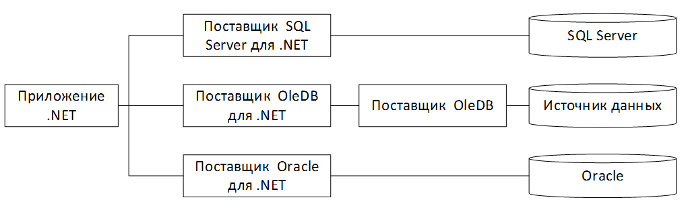
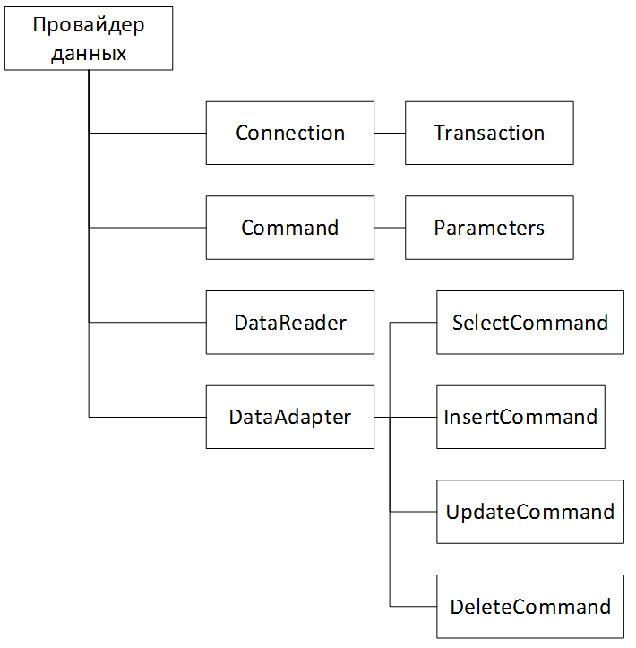
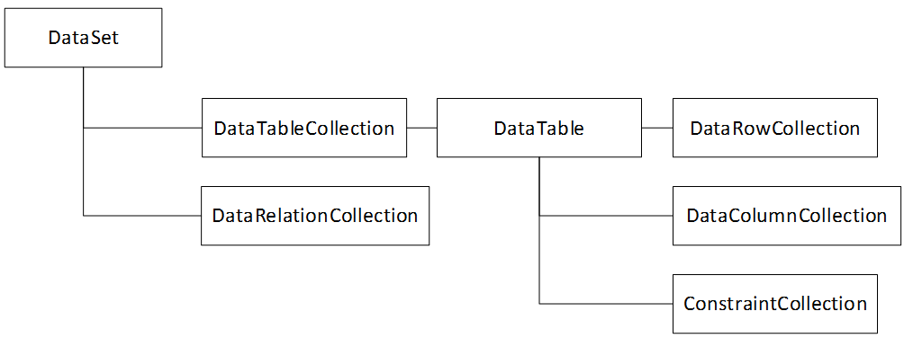

___
# Вопрос 31: Обзор механизмов доступа к данным ADO.NET. Создание подключения к базе данных.  Доступ к данным с использованием LINQ к SQL.
___

## ADO.NET

ADO.NET представляет собой набор библиотек, входящих в Microsoft .NET Framework предназначенных для взаимодействия с различными хранилищами данных из .NET приложений.

Библиотеки ADO.NET включают все необходимые классы для подключения к источникам данных практически произвольного формата, выполнения запросов к этим источникам и получения результата. Это возможно благодаря одной из основных идей, лежащих в основе ADO.NET является наличие поставщиков данных. Поставщик данных — это набор классов, предназначенных для взаимодействия с хранилищем данных определенного типа.



Каждый поставщик данных может обеспечивать доступ только к базе данных определенного формата.

Если поставщики данных для каких — либо СУБД не выделены в ADO.NET, то для взаимодействия с ними может применяться поставщик данных OLE DB для .NET или ODBC для .NET, которые обеспечивают доступ к любым данным, для которых существует драйвер OLE DB, либо ODBC соответственно. Тем не менее, всегда предпочтительнее использовать тот поставщик данных, который специально предназначен для обеспечения доступа к данному источнику данных, т.к. он учитывает его особенности.

Несомненным достоинством ADO.NET является возможность работы с отсоединенными источниками данных, представляющих собой структуры, организующие данные в оперативной памяти компьютера, работать с которыми возможно с использованием ставших уже привычными средств доступа к данным. 

**Подсоединенные объекты** необходимы для управления соединением, транзакциями, выборкой данных и передачей изменений данных в БД, т.е. они непосредственно взаимодействуют с базой данных. Каждый провайдер данных должен их реализовать для конкретной БД.



* Объект Connection представляет соединение с источником данных. 
* Объект Transaction позволяет осуществлять транзакции. 
* Объект DataAdapter представляет собой связующее звено между отсоединенными объектами ADO.NET и базой данных. С его помощью осуществляется заполнение таких объектов как DataSet или DataTable значениями, полученными в результате выполнения запроса к базе данных для последующей автономной работы с ними. Помимо этого, DataAdapter реализует эффективный механизм выполнения обновления данных, хранимых в базе данных изменениями, внесенными в данные объектов DataSet и DataTable. 
* Объект Command представляет запрос к источнику данных, вызов хранимой процедуры или прямой запрос на возврат содержимого конкретной таблицы. 
* Объект Parameter позволяет вводить в запрос элемент, значение которого может быть задано непосредственно перед исполнением запроса. 
* Объект DataReader предназначен для максимально быстрой выборки и просмотра возвращаемых запросом записей. 

**Отсоединенные объекты** позволяют работать с данными автономно:



* Объект DataSet представляет собой отсоединенный набор данных, который может рассматриваться как контейнер для объектов DataTable. DataSet позволяет организовывать внутри себя структуру, полностью соответствующую реальной структуре таблиц и связей между ними в БД. 
* Объект DataTable позволяет просматривать данные в виде наборов записей и столбцов. 
* Объект DataColumn представляет собой столбец объекта DataTable. Набор же всех столбов объекта DataTable представляет собой коллекцию Columns.
* Объект DataRow представляет собой строку объекта DataTable. Набор всех строк этого объекта представляет собой коллекцию Rows.
* Объект DataView предназначен для организации возможности просмотра содержимого DataTable различными способами. Это относится к таким операциям, как сортировка и фильтрация записей.
* Объект DataRelation представляет собой описание связей между таблицами реляционной базы данных. Он предоставляется объектом DataSet и позволяет организовывать взаимосвязи между таблицами отсоединенного набора данных объекта DataSet. 

## LINQ
LINQ (Language — Integrated Query) представляет простой и удобный язык запросов к источнику данных. В качестве источника данных может выступать объект, реализующий интерфейс IEnumerable (например, стандартные коллекции, массивы), набор данных DataSet, документ XML. Но вне зависимости от типа источника LINQ позволяет применить ко всем один и тот же подход для выборки данных.

## LINQ to SQL
Инициализация контекста данных для доступа к данным
```csharp
static string connectionString = @"Data Source=.\SQLEXPRESS;Initial Catalog=usersdb;Integrated Security=True";
DataContext db = new DataContext(connectionString);
```

Фильтрация и сортировка
```csharp
var query = from u in db.GetTable<User>()
            where u.Age > 25
            orderby u.FirstName
            select u;
// или так
// var query = db.GetTable<User>().Where(u => u.Age > 25).OrderBy(u => u.FirstName);
```

```sql
SELECT [t0].[Id], [t0].[Name] AS [FirstName], [t0].[Age]
FROM [Users] AS [t0]
WHERE [t0].[Age] > 25
ORDER BY [t0].[Name]
```

Группировка
```csharp
var query = from u in db.GetTable<User>()
            group u by u.Age // группировка по возрасту
            into grouped
            select grouped;
// или так
// var query = db.GetTable<User>().GroupBy(u => u.Age);
```

```sql
SELECT [t0].[Age] AS [Key]
FROM [Users] AS [t0]
GROUP BY [t0].[Age]
```

Пагинация
```csharp
int pageNumber = 0; // текущая страница
int pageSize = 5; // кол-во элементов на странице
int count = 0; // сколько всего элементов

count = db.GetTable<User>().Count();
if(count>pageNumber*pageSize)
{
    var query = db.GetTable<User>().Skip(pageNumber * pageSize).Take(pageSize);
    foreach (var user in query)
    {
        Console.WriteLine("{0} \t{1} \t{2}", user.Id, user.FirstName, user.Age);
    }
}
```

Изменение данных
```csharp
// возьмем первого пользователя
User user1 = db.GetTable<User>().FirstOrDefault();
// и изменим у него возраст
user1.Age = 28;
// сохраним изменения
db.SubmitChanges();
```

```sql
UPDATE [Users]
SET [Age] = @p3
WHERE ([Id] = @p0) AND ([Name] = @p1) AND ([Age] = @p2)
 
@p0 int,
@p1 nvarchar(4000),
@p2 int,@p3 int
 
@p0=2,@p1='Eugene',@p2=28,@p3=31
```

Создание
```csharp
// создаем нового пользователя
User user1 = new User { FirstName = "Ronald", Age = 34 };
// добавляем его в таблицу Users
db.GetTable<User>().InsertOnSubmit(user1);
db.SubmitChanges();
```

```sql
INSERT INTO [Users]([Name], [Age])
VALUES (@p0, @p1)
 
SELECT CONVERT(Int,SCOPE_IDENTITY()) AS [value]
 
@p0 nvarchar(4000),
@p1 int
 
p0='Ronald',
@p1=34
```

Удаление
```csharp
// получим последний объект для удаления
var user = db.GetTable<User>().OrderByDescending(u=>u.Id).FirstOrDefault();
 
if(user!=null)
{ 
    db.GetTable<User>().DeleteOnSubmit(user);
    db.SubmitChanges();
}
```

```sql
DELETE FROM [Users] WHERE ([Id] = @p0) AND ([Name] = @p1) AND ([Age] = @p2)
 
@p0 int,
@p1 nvarchar(4000),
@p2 int
 
@p0=42,
@p1='Ronald',
@p2=34
```

Хранимые процедуры
```sql
CREATE PROCEDURE [dbo].[sp_GetAgeRange]
    @name nvarchar(50)='%',
    @minAge int out,
    @maxAge int out
AS
    SELECT @minAge = MIN(Age), @maxAge = MAX(Age) FROM Users WHERE Name LIKE @name
GO
```

Добавить метод в DbContext
```csharp
[Function(Name = "sp_GetAgeRange")]
[return: Parameter(DbType = "Int")]
public int GetAgeRange([Parameter(Name = "name", DbType = "NVarChar(50)")] string name,
[Parameter(Name = "minAge", DbType = "Int")] ref int minAge,
[Parameter(Name = "maxAge", DbType = "Int")] ref int maxAge)
{
    IExecuteResult result = this.ExecuteMethodCall(this, ((MethodInfo)(MethodInfo.GetCurrentMethod())), name, minAge, maxAge);
    minAge = ((int)(result.GetParameterValue(1)));
    maxAge = ((int)(result.GetParameterValue(2)));
    return ((int)(result.ReturnValue));
}
```

```csharp
int minAge=0, maxAge = 0;
string name = "Tom";
db.GetAgeRange(name, ref minAge, ref maxAge);
```