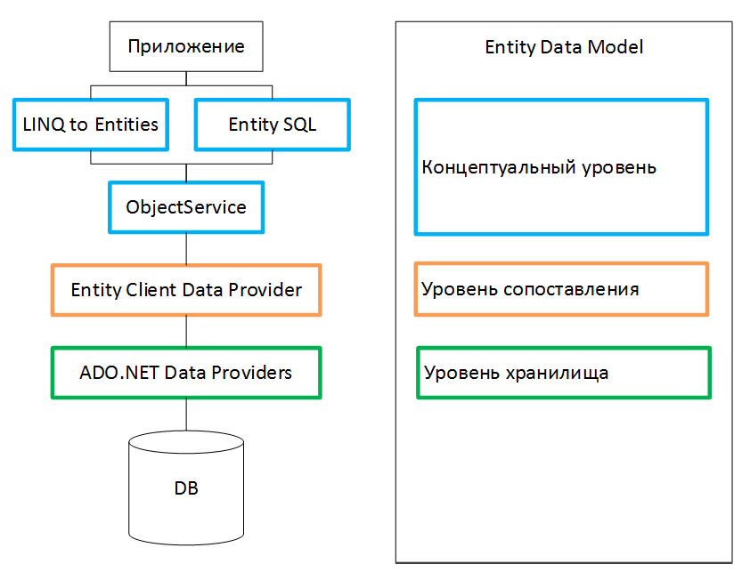

___
# Вопрос 33: Доступ к данным с использованием технологии EF.
___

**Entity Framework** представляет специальную объектно — ориентированную технологию на базе фреймворка .NET для работы с данными. Если традиционные средства ADO.NET позволяют создавать подключения, команды и прочие объекты для взаимодействия с базами данных, то Entity Framework представляет собой более высокий уровень абстракции, который позволяет абстрагироваться от самой базы данных и работать с данными независимо от типа хранилища. Если на физическом уровне мы оперируем таблицами, индексами, первичными и внешними ключами, но на концептуальном уровне, который нам предлагает Entity Framework, мы уже работает с объектами.

Преимущества при использовании Entity Framework:
* Могут работать концептуальной моделью в терминах предметной области;
* Освобождаются от жестких зависимостей от конкретного ядра СУБД или схемы хранения;
* Сопоставления между концептуальной моделью и схемой, специфичной для конкретного хранилища;
* Возможность работы с согласованной моделью объектов приложения, которая может быть сопоставлена с различными схемами хранения;
* Несколько концептуальных моделей могут быть сопоставлены с единой схемой хранения;
* Поддержка LINQ.

Центральной концепцией Entity Framework является понятие сущности или *entity*. Сущность представляет сабой набор данных, ассоциированных с полями объекта. Поэтому данная технология предполагает работу не с таблицами, а с объектами и их наборами.
Любая сущность, как и любой объект из реального мира, обладает рядом свойств. Например, если сущность описывает человека, то мы можем выделить такие свойства, как имя, фамилия, рост, возраст, вес. Свойства необязательно представляют простые данные типа int, но и могут представлять более комплексные структуры данных. И у каждой сущности может быть одно или несколько свойств, которые будут отличать эту сущность от других и будут уникально определять эту сущность. Подобные свойства называют ключами.
При этом сущности могут быть связаны ассоциативной связью один – ко – многим, один– ко – одному и многие – ко – многим, подобно тому, как в реальной базе данных происходит связь через внешние ключи.



**ObjectService** является основной точкой входа для доступа к данным из базы данных и их возврата. ObjectService отвечает за материализацию, которая представляет собой процесс преобразования данных, возвращаемых Entity Client Data Provider в структуру объекта сущности.
1. Основное использование Object Context заключается в выполнении различных операций, таких как добавление, удаление экземпляров сущностей и сохранение измененного состояния обратно в базу данных с помощью запросов.
2. Это уровень ORM Entity Framework, который представляет результат данных для экземпляров объектов сущностей.
3. Эти службы позволяют разработчику использовать некоторые из богатых функций ORM, таких как сопоставление первичных ключей, отслеживание изменений и т. д. путем написания запросов с использованием LINQ и Entity SQL.

Ключевым понятием Entity Framework является Entity Data Model. Эта модель сопоставляет классы сущностей с реальными таблицами (для SQL) или документами (NOSQL) в БД. Она состоит из трех уровней:
* Концептуальный уровень, на нем происходит определение классов сущностей, используемых в приложении;
* Уровень хранилища определяет таблицы, столбцы, отношения между таблицами и типы данных, с которыми сопоставляется используемая база данных;
*  Уровень сопоставления служит посредником между предыдущими двумя, определяя сопоставление между свойствами класса сущности и столбцами таблиц.

Реализуем пример работы с БД, используя Entity Framework. Определяем класс модели User, которая будет сопоставляться с таблицей в БД:
```csharp
public class User
{
    public int Id { get; set; }
    public string Name { get; set; }
    public int Age { get; set; }
}
```

Определим класс UserContext:
```csharp
using System;
using System.Collections.Generic;
using System.Data.Entity;
 
namespace Example
{
    class UserContext : DbContext
    {
        public UserContext()
            :base("DbConnection")
        { }
          
        public DbSet<User> Users { get; set; }
    }
}
```

Основу функциональности Entity Framework составляют классы, находящиеся в пространстве имен System.Data.Entity. Среди всего набора классов этого пространства имен следует выделить следующие:
* DbContext: определяет контекст данных, используемый для взаимодействия с базой данных.
* DbModelBuilder: сопоставляет классы на языке C# с сущностями в базе данных.
* DbSet/DbSet<TEntity>: представляет набор сущностей, хранящихся в базе данных

В любом приложении, работающим с БД через Entity Framework, нам нужен будет контекст (класс производный от DbContext) и набор данных DbSet, через который мы сможем взаимодействовать с таблицами из БД. В данном случае таким контекстом является класс UserContext.

Напишем пример, который выполняет сохранение двух разных объектов моделей в БД, а затем выполняет запрос для получения всех объектов, которые хранятся в БД:
```csharp
using System;
 
namespace Example
{
    class Program
    {
        static void Main(string[] args)
        {
            using(UserContext db = new UserContext())
            {
                // создаем два объекта User
                User user1 = new User { Name = "Tom", Age = 33 };
                User user2 = new User { Name = "Sam", Age = 26 };
 
                // добавляем их в бд
                db.Users.Add(user1);
                db.Users.Add(user2);
                db.SaveChanges();
                Console.WriteLine("Объекты успешно сохранены");
 
                // получаем объекты из бд и выводим на консоль
                var users = db.Users;
                Console.WriteLine("Список объектов:");
                foreach(User u in users)
                {
                    Console.WriteLine("{0}.{1} - {2}", u.Id, u.Name, u.Age);
                }
            }
            Console.Read();
        }
    }
}
```