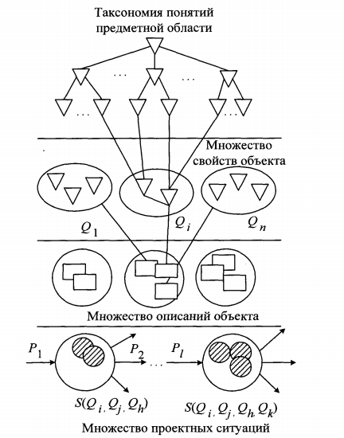

___
# Вопрос 36: Система представления знаний. Декомпозиция и классификация. Таксономическая схема понятий.
___

## Система представления знаний

(Написал здесь про представление знаний, возможно, нужно было про экспертные системы)

Как показывают исследования ряда естественных языков и различных
предметных областей, существует конечное множество базовых отношений между информационными единицами и объектами реального мира, используя комбинации которых можно выразить необходимые отношения. Отношением называется взаимозависимость или взаимодействие двух или более объектов либо явлений абстрактного или конкретного типа. (виды отношений рассмотрены в [вопросе 37](37.md))

Первым этапом разработки смысловой модели является выбор метода
представления инженерных знаний, который определяет форму описания
фактов и закономерностей предметной области. По способам организации знаний и их обработки различают следующие основные группы методов представления: логические, продукционные, сетевые, фреймовые.

### Логические методы представления знаний

Логические методы представления знаний базируются на использовании понятия формальной системы, задаваемой множеством базовых элементов, множеством синтаксических правил, позволяющих строить из базовых элементов синтаксически правильные выражения, множеством аксиом, множеством семантических правил вывода, позволяющих расширять
множество аксиом за счет других выражений. 

Логические методы представления знаний обеспечивают единственность теоретического обоснования системы формально точных определений и выводов, простоту и ясность нотации для записи фактов, которая обладает чётко определенной семантикой. В то же время основным недостатком логических методов является отсутствие четких принципов организации фактов в базе знаний, что затрудняет ее анализ и обработку. Ввиду этого логические методы используются в основном в тех предметных областях, где система знаний невелика по объему и имеет однородную структуру.
 (подробнее в [вопросе 38](38.md))

### Продукционные системы

Принцип работы продукционных систем основан на поиске путей перевода исходного состояния задачи в целевое с использованием правил продукций. Каждое такое правило имеет вид «ЕСЛИ — условие,
ТО — действие». Пример правила: «ЕСЛИ компьютеру не выйти в Интернет и его IP-адрес начинается с 169.254., ТО в сети проблема с DHCP сервером». Анализируя текущее состояние задачи, система определяет множество продукций, «условия» которых удовлетворяют рассматриваемому состоянию, и выбирает из них одну, реализуя определяемое продукцией «действие». Затем анализируется состояние, в которое перешла система, и выполняется следующее действие, т. е. процесс повторяется до тех пор, пока либо не найдется продукция, «условие» которой соответствует текущему состоянию, либо не будет достигнуто целевое состояние. 

Наряду с такими положительными чертами, как простота создания и понимания отдельных правил, процедуры их пополнения и модификации,
а также естественность организации логического вывода, продукционные системы обладают невысоким быстродействием вследствие необходимости периодического сопоставления реальной ситуации с образцом - «условием». 

### Семантические сети

В основе сетевых методов лежит представление знаний в виде множества понятий, связанных семантическими отношениями. Графически понятия выражаются вершинами сети, отношения - направленными дугами. Использование семантических сетей в качестве модели представления знаний дает следующие преимущества:
- наглядное отображение взаимосвязей между объектами базы знаний; 
- хорошие классификационные свойства сети; 
- высокая смысловая выразительность сети, что обеспечивает прямое моделирование семантики предметной области и позволяет проектировщику обращаться с системой на уровне понятий профессионально-ориентированного языка; 
- возможность легко модифицировать представленные данные. 

Наряду с преимуществами семантические сети обладают и рядом недостатков, основными из которых являются слишком «произвольная» структура графа и большое разнообразие типов вершин и отношений. Обе эти особенности приводят к сложностям, возникающим при разработке программного обеспечения. (подробнее в [вопросе 37](37.md))

### Фреймы

Разновидностью сетевых моделей является фреймовое представление знаний. Фрейм представляет собой информационную структуру, описывающую конкретный стандартный фрагмент знаний (объект, ситуацию, процедуру и т. п.). 

Достоинством представления инженерных знаний в виде системы фреймов является структурированность информации по сравнению с семантическими сетями, более компактное представление о конкретных фактах, ситуациях и т. п., возможность описывать в рамках одного фрейма одновременно как декларативные, так и процедурные знания. (подробнее в [вопросе 37](37.md))

## Декомпозия

Под декомпозицией понимается разбиение задачи на относительно независимые части (подзадачи). Декомпозиция задачи может быть проведена несколькими способами: по заданиям, по данным, по информационным потокам.

### Декомпозиция по заданиям
Декомпозиция по заданиям (функциональная декомпозиция) предполагает присвоение разным потокам разных функций. Например, приложение выполняющее правку документа включает следующие функции: проверка орфографии, проверка пунктуации, форматирование текста в соответствие с выбранными стилями, подсчет статистики по документу, сохранение изменений в файле и отправка документа по электронной почте. Функциональная декомпозиция разбивает работу приложения на подзадачи таким образом, чтобы каждая подзадача была связана с отдельной функцией. Но не все операции могут выполняться параллельно. Например, сохранение документа и отправка документа выполняются только после завершения всех предыдущих этапов. Форматирование и сбор статистики могут выполняться параллельно, но только после завершения проверки орфографии и пунктуации.

### Декомпозиция по информационным потокам
Декомпозиция по информационным потокам выделяет подзадачи, работающие с одним типом данных. В рассматриваемом примере могут быть выделены следующие подзадачи:

- Работа с черновым документом (орфография и пунктуация);
- Работа с исправленным документом (форматирование и сбор статистики);
- Работа с готовым документом (сохранение и отправка).

### Декомпозиция по данным
При декомпозиции по данным каждая подзадача работает со своим фрагментом данных, выполняя весь перечень действий. В рассматриваемом примере декомпозиция по данным может применяться к задачам, допускающим работу с фрагментом документа. Таким образом, функции проверки орфографии, проверки пунктуации, подсчета статистики по документу, форматирования текста объединяются в одну подзадачу, но создается несколько экземпляров этой подзадачи, которые параллельно работают с разными фрагментами документа. Функции сохранения изменений и отправки документа по электронной почте составляют отдельные подзадачи, так как не могут работать с частью документа. 

При декомпозиции по данным каждая подзадача выполняет одни и те же действия, но с разными данными. Во многих задачах, параллельных по данным, существует несколько способов разделения данных. Например, задача матричного умножения допускает разделение по строчкам – каждый поток обрабатывает одну или несколько строчек матрицы, по столбцам – каждый поток обрабатывает один или несколько столбцов, а также по блокам заданного размера.

## Классификация

Классификация - системное распределение изучаемых предметов, явлений, процессов по родам, видам, типам, по каким-либо существенным признакам для удобства их исследования; группировка исходных понятий и расположение их в определенном порядке, отражающем степень этого сходства.

Классификация - упорядоченное по некоторому принципу множество объектов, которые имеют сходные классификационные признаки (одно или несколько свойств), выбранных для определения сходства или различия между этими объектами.

Классификация требует соблюдения следующих правил:

- в каждом акте деления необходимо применять только одно основание;
- деление должно быть соразмерным, т.е. общий объем видовых понятий должен равняться объему делимого родового понятия;
- члены деления должны взаимно исключать друг друга, их объемы не должны перекрещиваться;
- деление должно быть последовательным.

Различают:

- вспомогательную (искусственную) классификацию, которая производится по внешнему признаку и служит для придания множеству предметов (процессов, явлений) нужного порядка;
- естественную классификацию, которая производится по существенным признакам, характеризующим внутреннюю общность предметов и явлений. Она является результатом и важным средством научного исследования, т.к. предполагает и закрепляет результаты изучения закономерностей классифицируемых объектов.

В зависимости от выбранных признаков, их сочетания и процедуры деления понятий классификация может быть:

- простой - деление родового понятия только по признаку и только один раз до раскрытия всех видов. Примером такой классификации является дихотомия, при которой членами деления бывают только два понятия, каждое из которых является противоречащим другому (т.е. соблюдается принцип: "А и не А");
- сложной - применяется для деления одного понятия по разным основаниям и синтеза таких простых делений в единое целое. Примером такой классификации является периодическая система химических элементов.

## Таксономическая схема понятий

Таксономия  — учение о принципах и практике классификации и систематизации сложноорганизованных иерархически соотносящихся сущностей. В строгом смысле таксо­но­мия предполагает классификацию, отражающую иерархическую организацию системы объек­тов. В структуре самой таксо­но­мии это выражается в иерархии таксо­номи­че­ских рангов (категорий), связанных отношением последовательного включения от низшего ранга к высшему; каждому рангу в таксо­но­мии соответствует класс объектов (таксон), характеризуемый определённой степенью обобщён­но­сти. 

(То, что ниже взято из методички "Модели и методы принятия проектных решений")

Важным аспектом создания модели предметной области является
формирование таксономии понятий. Таксономия - частный случай онтологии, а именно $$ \Omega $$ = T = <C, { $$ R^T $$ }, { }>, где $$  R^T $$ - теоретико-множественные отношения. Таксономия используется для смыслового разделения лексики предметной области. В таксономии различают свойства и их значения.
Свойства указывают точки смыслового дробления лексики, а их значения определяют области, получаемые в результате такого дробления. Формально таксономия свойств как алгебраическая система - это четверка $$ <D, Z, R_1, R_2> $$, где D - множество свойств; Z - множество их значении, $$ R_1 $$  — отношение на D х Z; $$ R_2 $$ - отношение на Z х D.

(То, что ниже взято из методички "Управление знаниями в распределенной информационной среде")

Пример: таксономия понятий предметной области автоматизированного проектирования.

В качестве функционально замкнутых единиц декларативных знаний
предметной области автоматизированного проектирования выделены 
понятия и отношения предметной области, свойства объектов, проектные описания и проектные ситуации. В совокупности они образуют единую систему абстрактных понятий, взаимосвязанных между собой. 

