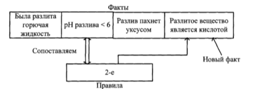
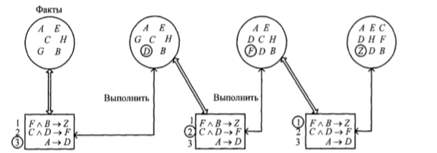
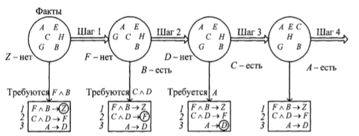

___
# Вопрос 38: Логическая модель представления знаний. Декларативное и процедурное представление знаний. Система логического вывода (СЛВ).
___

## Логическая модель представления знаний

Логические методы представления знаний базируются на использовании понятия формальной системы, задаваемой множеством базовых элементов, множеством синтаксических правил, позволяющих строить из базовых элементов синтаксически правильные выражения, множеством аксиом, множеством семантических правил вывода, позволяющих расширять множество аксиом за счет других выражений. 

В основе логической модели представления знаний лежит понятие формальной теории. Формальная теория задается четверкой *S = (B, F, A, R)*, где *В* - счетное множество базовых символов (алфавит теории *S*); *F* - подмножество выражений теории *S*, называемых формулами теории; *A* - выделенное множество формул, называемых аксиомами теории *S* (множество априорно истинных формул); $$ R = {r_1,..., r_n} $$ - конечное множество отношений 
между формулами, называемое правилами вывода. 

Обычно существует эффективная процедура построения выражений, являющихся формулами. Эту процедуру можно рассматривать как множество синтаксических правил, позволяющих строить из В синтаксически правильные выражения, т. е. формулы. Для любого $$ r_i $$ существует целое положительное число $$ j \in Z $$, такое, что для каждого множества, состоящего из *j* формул, и для каждой формулы *f* эффективно решается вопрос о том, находятся ли данные *j* формул в отношении ту с формулой *f*. Если отношение $$ r_i $$ выполняется, то *f* называется непосредственным следствием данных $$ f_n $$ формул по правилу $$ r_i $$.

Следствием (выводом) формулы $$ f_n $$ в теории $$ S $$ называется последовательность $$ f_1,..., f_n $$ формул, такая, что для любого *i* формула $$ f_i $$ есть
пибо аксиома теории $$ S ( f_i \in A) $$, либо непосредственное следствие какой-либо из предыдущих формул по одному из правил вывода. 

Правила вывода позволяют расширять множество формул, которые считаются истинными в рамках данной теории *S*. Формальная теория называется разрешимой, если существует единая эффектная процедура, позволяющая для любой формулы установить, существует ли ее вывод в системе *S*. Формальная теория *S* называется *непротиворечивой* если не существует такой формулы *D*, что и $$ \overline{D} $$, и *D* выводимы в *S*.

Наиболее распространенной формальной теорией, используемой для представления знаний, является исчисление предикатов [(Вопрос 40)](40.md). 

Логические методы представления знаний обеспечивают единственность теоретического обоснования системы формально точных определений и выводов, простоту и ясность нотации для записи фактов, которая обладает чётко определенной семантикой. В то же время основным недостатком логических методов является отсутствие четких принципов организации фактов в базе знаний, что затрудняет ее анализ и обработку. Ввиду этого логические методы используются в основном в тех предметных областях, где система знаний невелика по объему и имеет однородную структуру.

## Декларативное и процедурное представление знаний

Знания любой предметной области имеют две составляющие: декларативную и процедурную. Для декларативного представления знаний используются таксономия понятий предметной области и языки описаний. Процедурные знания можно разделить на операционные и управляющие. К операционным знаниям относятся методы, процессы и процедуры, а к управляющим - стратегии, способы реализации стратегий и условия выбора проектных процедур. 

Декларативные знания – это знания об объектах и явлениях окружающего мира, которые носят описательный характер. Процедурные знания – это знания, которые хранятся в памяти интеллектуальной системы в виде описания процедур, при помощи которых можно их получить. 

Декларативные знания отвечают на вопросы: Что это? Как это бывало, бывает, случается? Я думаю по этому поводу, что… Мне кажется… Я чувствую, что это…

Процедурные знания отвечают на вопросы: Как это сделать? Как это сделать наилучшим образом? Как исключить типовые ошибки во время осуществления?

## Система логического вывода

Система логического вывода (СЛВ) - это средство управления рассуждениями. Логический вывод (ЛВ) сводится к упорядоченному раскрытию правил, которые определяются стратегией. Использование разных стратегий на данной модели дает разные результаты. На языке экспертных систем термин правило имеет более узкое значение, чем обычно. Это наиболее популярный способ представления знаний. Правила обеспечивают формальный способ представления рекомендаций, указаний, стратегий. Правила часто возникают из эмпирических ассоциаций. Знания в базе знаний представляются набором правил. Правила проверяются на группе фактов или знаний о текущей ситуации. Интерпретатор правил сопоставляет левые части правил (за словом «если») - посылки, с фактами правой части правил и выполняет то правило, посылка которого согласуется с фактами. Правила выражаются в виде утверждений «Если..., то...» или в виде импликаций. Рассмотрим пример:

Если была разлита горючая жидкость, то вызовите пожарных. 2. Если pH жидкости <6, то разлившийся материал - кислота. 3. Если разлившийся материал - кислота, и он пахнет уксусом, то разлившийся материал - уксусная кислота. Действие правила может состоять в модификации набора фактов в базе знаний, например добавление нового факта.

Новые факты, добавленные в базу знаний, могут сами быть использованы для сопоставления с левыми частями правил.

Процесс сопоставления посылок правил с фактами может порождать цепочки выводов.

Существует два основных способа вывода: прямой и обратный. Цель прямого вывода - порождение данных на основе исходных данных и логических рассуждений. Цель обратного вывода - определение причин, т. е. фактов, которые привели к определенному результату (значению целевой функции). Для упрощения обозначения правила буквами латинского алфавита. 

Рассмотрим прямой ЛВ. Пусть в БД находятся факты *A, B, C, E, G, H* и правила $$ F \wedge B \to Z, C \vee D \to F, A \to D. $$

Допустим, что каждый раз, когда набор правил проверяется относительно БД, то только самое верхнее правило, согласующееся с БД, выполняется. Тогда $$ A \to D $$ выполняется только один раз. Таким образом, получаем последовательность вывода, представленную на рисунке ниже. 

Из этого примера может показаться, что система достаточно быстро устанавливает факт *Z*, однако у реальной системы не три правила, а сотни и тысячи. Если использовать систему с большим числом правил для выяснения информации, связанной с *Z*, то необходимо использовать правила, не имеющие никакого отношения к *Z*. При этом было бы получено большое число цепочек вывода ситуаций справедливых, но с *Z* никак не связанных. Поэтому если цель системы вывода состоит в том, чтобы установить один конкретный частный факт типа *Z* , то прямой ЛВ может оказаться напрасной тратой времени и денег. В таких ситуациях обратный ЛВ может быть рентабельней. 

Рассмотрим обратный ЛВ. Система начинает с того, что нужно доказать. Например, что ситуация Z существует и нужно выполнить только те правила, которые относятся к установлению этого факта. 

Шаг 1. Системе сообщается, что она должна установить, что ситуация *Z* существует. Сначала система начинает искать факты в БД, в случае неудачи будет искать правило, в котором *Z* стоит в заключении. Затем необходимо установить *F* и *В*. 

Шаг 2. Поиск *F* сначала в БД, затем - поиск соответствующего правила, в котором *F* в заключении; следовательно, необходимо установить *С* и *D*. 

Шаг 3. Поиск *D* сначала в БД, затем - поиск соответствующего правила, следовательно, необходимо установить *А*. 

Шаг 4. Поиск *А* в БД - найдено. 

Далее добавляем в БД новые факты и устанавливаем *Z*. Отличие между прямым и обратным ЛВ в способе поиска правил и данных. На маленьком числе правил создается впечатление, что обратный поиск более громоздок и сложен, но при большем числе правил обратный поиск более лаконичен.
