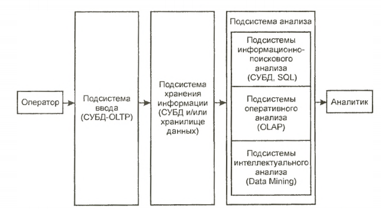

___
# Вопрос 41: Системы поддержки принятия решений
___

Система поддержки принятия решений, СППР, Decision Support System, DSS - компьютерная автоматизированная система, целью которой является помощь людям, принимающим решение в сложных условиях для полного и объективного анализа предметной деятельности. СППР возникли в результате слияния управленческих информационных систем и систем управления базами данных.

Для выполнения анализа СППР должна накапливать информацию, обладая
средствами ее ввода и хранения. 

Таким образом, СППР — это системы, обладающие средствами ввода, хранения и анализа данных, относящихся к определенной предметной области, с целью поиска решений.

Ввод данных в СППР осуществляется либо автоматически от датчиков, характеризующих состояние среды или процесса, либо человеком-оператором.

Система поддержки решений СППР решает две основные задачи:

- выбор наилучшего решения из множества возможных (оптимизация),
- упорядочение возможных решений по предпочтительности (ранжирование)

В обеих задачах первым и наиболее принципиальным моментом является выбор совокупности критериев, на основе которых в дальнейшем будут оцениваться и сопоставляться возможные решения (будем называть их также альтернативами). Система СППР помогает пользователю сделать такой выбор.

Система позволяет решать задачи оперативного и стратегического управления на основе учетных данных о деятельности компании.

Система поддержки принятия решений представляет собой комплекс программных инструментальных средств для анализа данных, моделирования, прогнозирования и принятия управленческих решений, состоящий из собственных разработок корпорации и приобретаемых программных продуктов (Oracle, IBM, Cognos).

Структура СППР:

Рассмотрим отдельные подсистемы более подробно.
- Подсистема ввода данных. В таких подсистемах, называемых OLTP (Online transaction processing), выполняется операционная (транзакционная) обработка данных. Для реализации этих подсистем используют обычные системы управления базами данных (СУБД).
- Подсистема хранения. Дпя реализации данной подсистемы используют
современные СУБД и концепцию хранилищ данных.
- Подсистема анализа. Данная подсистема может быть построена на основе:

    • подсистемы информационно-поискового анализа на базе реляционных СУБД и статических запросов с использованием языка структурных запросов SQL (Structured Query Language);

    • подсистемы оперативного анализа. Для реализации таких подсистем применяется технология оперативной аналитической обработки данных OLAP (On-line analytical processing), использующая концепцию многомерного представления данных;

    • подсистемы интеллектуального анализа. Данная подсистема
    реализует методы и алгоритмы Data Mining ("добыча данных").

По взаимодействию с пользователем выделяют три вида СППР:

- пассивные помогают в процессе принятия решений, но не могут выдвинуть конкретного предложения;
- активные непосредственно участвуют в разработке правильного решения;
- кооперативные предполагают взаимодействие СППР с пользователем. Выдвинутое системой предложение пользователь может доработать, усовершенствовать, а затем отправить обратно в систему для проверки. После этого предложение вновь представляется пользователю, и так до тех пор, пока он не одобрит решение.

По способу поддержки различают:

- модельно-ориентированные СППР, используют в работе доступ к статистическим, финансовым или иным моделям;
СППР, основанные на коммуникациях, поддерживают работу двух и более пользователей, занимающихся общей задачей;
- СППР, ориентированные на данные, имеют доступ к временным рядам организации. Они используют в работе не только внутренние, но и внешние данные;
- СППР, ориентированные на документы, манипулируют неструктурированной информацией, заключенной в различных электронных форматах;
- СППР, ориентированные на знания, предоставляют специализированные решения проблем, основанные на фактах.

По сфере использования выделяют:

- общесистемные
- настольные СППР.

СППР позволяет облегчить работу руководителям предприятий и повысить ее эффективность. Они значительно ускоряют решение проблем в бизнесе. СППР способствуют налаживанию межличностного контакта. На их основе можно проводить обучение и подготовку кадров. Данные информационные системы позволяют повысить контроль над деятельностью организации. Наличие четко функционирующей СППР дает большие преимущества по сравнению с конкурирующими структурами. Благодаря предложениям, выдвигаемым СППР, открываются новые подходы к решению повседневных и нестандартных задач.
