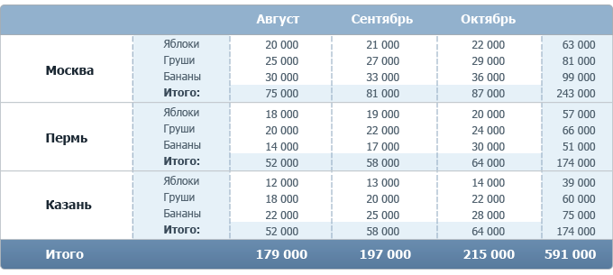

___
# Вопрос 42: Многомерные данные и OLAP-технологии.
___

## Многомерные данные

Многомерные базы данных – разновидность реляционной модели, которая использует многомерные структуры для организации данных и выражают отношения между данными. Поддерживают неограниченное число значений в поле, и находят свое применение там, где необходима эффективная и простая работа с большими массивами символьной информации.

Технология многомерных баз данных — ключевой фактор интерактивного анализа больших массивов данных с целью поддержки принятия решения. Подобные базы данных трактуют данные как многомерные кубы, что очень удобно именно для их анализа.

Многомерные модели данных имеют три важных области применения, связанных с проблематикой анализа данных.

1. Хранилища данных интегрируют для анализа информации из нескольких источников.
2. Системы оперативной аналитической обработки (online analytical processing — OLAP) позволяют оперативно получить ответы на запросы, охватывающие большие объемы данных в поисках общих тенденций.
3. Приложения добычи данных служат для выявления знаний за счет полуавтоматического поиска ранее неизвестных шаблонов и связей в базах данных.

Основные свойства, присущие многомерным БД:

* Агрегируемость данных - рассмотрение информации на различных уровнях ее обобщения. В информационных системах степень детальности представления информации для пользователя зависит от его уровня: аналитик, пользователь, управляющий, руководитель.

* Историчность данных - предполагает обеспечение высокого уровня статичности собственно данных и их взаимосвязей, а также обязательность привязки данных ко времени.

* Прогнозируемость данных - подразумевает задание функций прогнозирования и применение их к различным временным интервалам.

Достоинства:

* В случае использования многомерных СУБД поиск и выборка данных осуществляется значительно быстрее, чем при многомерном концептуальном взгляде на реляционную базу данных, так как многомерная база данных денормализована, содержит заранее агрегированные показатели и обеспечивает оптимизированный доступ к запрашиваемым ячейкам.
* Многомерные СУБД легко справляются с задачами включения в информационную модель разнообразных встроенных функций, тогда как объективно существующие ограничения языка SQL делают выполнение этих задач на основе реляционных СУБД достаточно сложным, а иногда и невозможным.
* Общая простота системы, что позволяет осуществлять быстрое встраивание технологий многомерных СУБД в приложения.
* Относительно низкая общая стоимость владения

Недостатки:

* Необходимость привлечения высококвалифицированных программистов для малейших изменений структуры базы данных.
* Невозможность для конечного пользователя самостоятельно анализировать данные в порядке, не предусмотренном программистами.
* Неэффективное, по сравнению с реляционными базами данных, использование внешней памяти

___

## OLAP-технологии

OLAP (on-line analytical processing) — набор технологий для оперативной обработки информации, включающих динамическое построение отчётов в различных разрезах, анализ данных, мониторинг и прогнозирование ключевых показателей бизнеса. В основе OLAP-технологий лежит представление информации в виде OLAP-кубов.

OLAP-кубы содержат бизнес-показатели, используемые для анализа и принятия управленческих решений, например: прибыль, рентабельность продукции, совокупные средства (активы), собственные средства, заемные средства и т.д.

Бизнес-показатели хранятся в кубах не в виде простых таблиц, как в обычных системах учета или бухгалтерских программах, а в разрезах, представляющих собой основные бизнес-категории деятельности организации: товары, магазины, клиенты, время продаж и т. д.

Благодаря детальному структурированию информации OLAP-кубы позволяют оперативно осуществлять анализ данных и формировать отчёты в различных разрезах и с произвольной глубиной детализации. Отчёты могут создаваться аналитиками, менеджерами, финансистами, руководителями подразделений в интерактивном режиме для того, чтобы быстро получить ответы, на возникающие ежедневно вопросы, и принять правильное решение. При этом сотрудникам, для создания отчетов не нужно прибегать к услугам программистов, на что обычно уходит немало времени.

Из OLAP-куба может быть составлен обычный плоский отчёт. По столбикам и строчкам отчёта будут бизнес-категории (грани куба), а в ячейках показатели.

