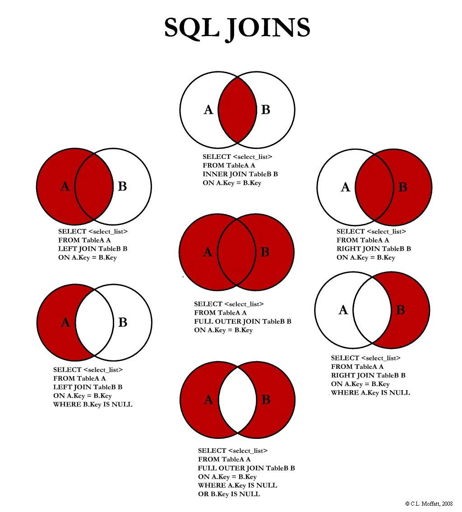

___

# Вопрос 7: Соединения таблиц. Использование соединения Inner Joins. Использование соединения Outer Joins. Применение Cross Joins. Соединение нескольких таблиц. Соединение, построенное на одной таблице.

___

С помощью соединения можно получать данные из двух или нескольких таблиц на основе логических связей между ними. Соединения позволяют указать, как в SQL Server должны использоваться данные из одной таблицы для выбора строк из другой таблицы.
Соединение определяет способ связывания двух таблиц в запросе следующим образом:

* для каждой таблицы указываются столбцы, используемые в соединении. В типичном условии соединения указывается внешний ключ из одной таблицы и связанный с ним ключ из другой таблицы;
* указывается логический оператор (например, = или <>,) для сравнения значений столбцов.

То, что условия соединения задаются в предложении FROM, помогает отделить их от условий поиска, которые могут быть заданы в предложении WHERE. Объединение рекомендуется задавать именно таким способом. Ниже приведен упрощенный синтаксис соединения с использованием предложения FROM стандарта ISO:

```sql
FROM first_table join_type second_table [ON (join_condition)]
```

join_type указывает на выполняемый тип соединения: внутреннее, внешнее или перекрестное. join_condition определяет предикат, который будет вычисляться для каждой пары соединяемых строк. Ниже приведен пример предложения FROM с заданным соединением:

```sql
FROM Purchasing.ProductVendor JOIN Purchasing.Vendor
     ON (ProductVendor.BusinessEntityID = Vendor.BusinessEntityID)
```

Ниже приведена простая инструкция SELECT, использующая это соединение:

```sql
SELECT ProductID, Purchasing.Vendor.BusinessEntityID, Name
FROM Purchasing.ProductVendor JOIN Purchasing.Vendor
    ON (Purchasing.ProductVendor.BusinessEntityID = Purchasing.Vendor.BusinessEntityID)
WHERE StandardPrice > $10
  AND Name LIKE N'F%'
GO
```

Если имя столбца не дублируется в двух или более таблицах, указанных в запросе, то ссылки на него уточнять именем таблицы не обязательно. Это показано в предыдущем примере. Подобную инструкцию SELECT иногда трудно понять, поскольку в ней нет ничего, что указывало бы на таблицы, из которых берутся столбцы. Запрос гораздо легче читать, если все столбцы указаны с именами соответствующих таблиц. Запрос будет читаться еще легче, если используются псевдонимы таблиц, особенно когда имена таблиц сами должны уточняться именами базы данных и владельца. Ниже приведен тот же пример, но чтобы упростить чтение, используются псевдонимы таблиц, уточняющие названия столбцов.

```sql
SELECT ProductID, Purchasing.Vendor.BusinessEntityID, Name
FROM Purchasing.ProductVendor JOIN Purchasing.Vendor
    ON (Purchasing.ProductVendor.BusinessEntityID = Purchasing.Vendor.BusinessEntityID)
WHERE StandardPrice > $10
  AND Name LIKE N'F%'
GO
```

Типы JOIN



`INNER JOIN`
Для явного соединения данных из двух таблиц применяется оператор JOIN. После оператора JOIN идет название второй таблицы, из которой надо добавить данные в выборку. Перед JOIN может использоваться необязательное ключевое слово INNER. Его наличие или отсутствие ни на что не влияет. Затем после ключевого слова ON указывается условие соединения. Это условие устанавливает, как две таблицы будут сравниваться. В большинстве случаев для соединения применяется первичный ключ главной таблицы и внешний ключ зависимой таблицы.

` {LEFT|RIGHT|FULL} [OUTER] `

MS SQL Server также поддерживает внешнее соединение или outer join. В отличие от inner join внешнее соединение возвращает все строки одной или двух таблиц, которые участвуют в соединении.

Outer Join имеет следующий формальный синтаксис:

```sql
SELECT столбцы
FROM таблица1
    {LEFT|RIGHT|FULL} [OUTER] JOIN таблица2 ON условие1
    [{LEFT|RIGHT|FULL} [OUTER] JOIN таблица3 ON условие2]...
```

Перед оператором JOIN указывается одно из ключевых слов LEFT, RIGHT или FULL, которые определяют тип соединения:

* LEFT: выборка будет содержать все строки из первой или левой таблицы
* RIGHT: выборка будет содержать все строки из второй или правой таблицы
* FULL: выборка будет содержать все строки из обоих таблиц

Также перед оператором JOIN может указываться ключевое слово OUTER, но его применение необязательно. Далее после JOIN указывается присоединяемая таблица, а затем идет условие соединения.

` CROSS JOIN `
Оператор SQL CROSS JOIN формирует таблицу перекрестным соединением (декартовым произведением) двух таблиц. При использовании оператора SQL CROSS JOIN каждая строка левой таблицы сцепляется с каждой строкой правой таблицы. В результате получается таблица со всеми возможными сочетаниями строк обеих таблиц.

Синтаксис CROSS JOIN:
```sql
SELECT
    column_names [,... n]
FROM
    Table_1 CROSS JOIN Table_2
```

Пример:

Authors — содержит в себе информацию об авторах книг:

AuthorID |	AuthorName
---|---
1	| Bruce Eckel
2	| Robert Lafore
3	| Andrew Tanenbaum

Books — содержит в себе информацию о названии книг:

BookID |	BookName
---|---
3 |	Modern Operating System
1 |	Thinking in Java
3 |	Computer Architecture
4 |	Programming in Scala

В таблице Books поле BookID являются внешним ключом и ссылаются на таблицу Authors.

Декартово произведение обеих таблиц с помощью оператора SQL CROSS JOIN:

```sql
SELECT *
FROM Authors CROSS JOIN Books
```

Результат

| Authors.AuthorID | Authors.AuthorName | Books.BookID | Books.BookName          |
|------------------|--------------------|--------------|-------------------------|
| 1                | Bruce Eckel        | 3            | Modern Operating System |
| 1                | Bruce Eckel        | 1            | Thinking in Java        |
| 1                | Bruce Eckel        | 3            | Computer Architecture   |
| 1                | Bruce Eckel        | 4            | Programming in Scala    |
| 2                | Robert Lafore      | 3            | Modern Operating System |
| 2                | Robert Lafore      | 1            | Thinking in Java        |
| 2                | Robert Lafore      | 3            | Computer Architecture   |
| 2                | Robert Lafore      | 4            | Programming in Scala    |
| 3                | Andrew Tanenbaum   | 3            | Modern Operating System |
| 3                | Andrew Tanenbaum   | 1            | Thinking in Java        |
| 3                | Andrew Tanenbaum   | 3            | Computer Architecture   |
| 3                | Andrew Tanenbaum   | 4            | Programming in Scala    |

Одна таблица

Пусть требуется создать Запрос по выборке всек клиентов (Компаний), независимо от того имеют ли данные компании Заказы, и Заказы, номеры которых известны для компаний. В следующем примере используется Левое-внешнее соединение (left outer join) для выборки всех записей из одной таблицы и только, соответствующих условию соединения, записей из другой таблицы

```sql
SELECT TAlias1.company, TAlias2.order_id ;
   FROM customer TAlias1 ;
   LEFT JOIN orders TAlias2 ;
      ON TAlias1.cust_id = TAlias2.cust_id
```

В результирующем наборе Запроса присутствуют Имена всех имеющихся компаний, в поле Order_ID выгружаются номера соответствующих Заказов. Для клиента с именем "Wenna Wines" данное поле содержит значение = nul, значит Заказы - отсутситвуют.